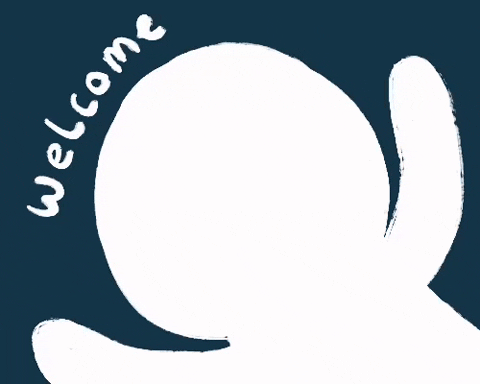

<!--cabeçalho HELLO WORD-->

  

  

<!--FIM cabeçalho HELLO WORD-->

<!--inicio descrição-->
## Eu sou o Max Castro, bem vindo ao meu perfil!

<ul align="left">
<li>📍Sou de Ipatinga - MG</li>
   
<li>👩‍💻 Estou me dedicando ao desenvolvimento Front-End, construindo uma base sólida em HTML, CSS, JavaScript e Git/GitHub. Além disso, estudo o universo do ReactJS, incluindo TypeScript e Next.js..</li>
</ul>
 
<!--FIM descrição-->

<!--INICIO Tecnologias-->
 
<h2 align="center">🛠️&ensp; <i>SOFT SKILLS</i> &ensp;🛠️</h2>

  

  

<!--Contatos-->
<h3 align="center"><i>C O N T A T O S</i></h2>

